# Snaps

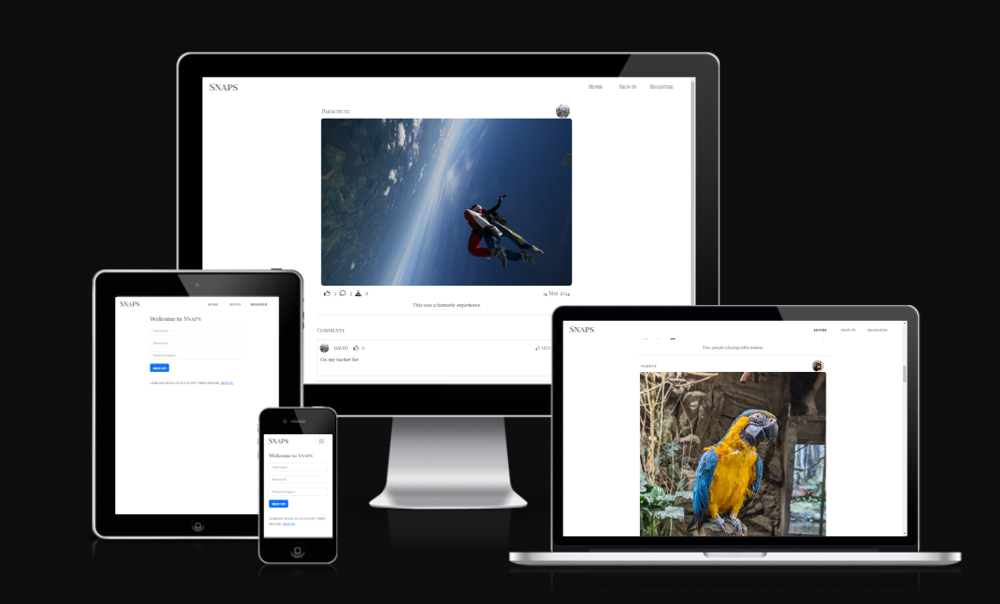

## Introduction

[Snaps](https://snaps-frontend-871b3764ee9c.herokuapp.com/) is a photo sharing website,
aimed a people who want to share their photos with others.

The backend for this application can be found here: [Snaps Backend](https://github.com/hogbergmarkus/snaps-backend)

As well as uploading your content, all photos uploaded to the website are eligible to be downloaded by any user.

The idea is to create a sharing community where you can either take part in adding content,

or just scroll to enjoy what others have created.

You can also engage in the community through comments and likes, as well as create collections for yourself,

by adding posts to your private albums so you can easily find your favorite posts.

## Table of Contents

- [Snaps](#snaps)
  - [Introduction](#introduction)
  - [Table of Contents](#table-of-contents)
  - [User Personas](#user-personas)
  - [User Stories](#user-stories)
  - [User Goals](#user-goals)
    - [The Casual](#the-casual)
    - [Amateur Photographer](#the-amateur-photographer)
    - [The Enthusiast](#the-enthusiast)
  - [Website Owner Goals](#website-owner-goals)
  - [Design](#design)
    - [Wireframes](#wireframes)
    - [Fonts](#fonts)
    - [Colors](#colors)
  - [Screenshots of Finished Website](#screenshots-of-finished-website)
  - [Features](#features)
  - [Features to Add](#features-to-add)
  - [React Components](#react-components)
    - [Reusable Components](#reusable-components)
    - [Contexts](#contexts)
    - [Hooks](#hooks)
    - [API](#api)
    - [Pages](#pages)
      - [Albums](#albums)
      - [Auth](#auth)
      - [Comments](#comments)
      - [Posts](#posts)
      - [Profiles](#profiles)
  - [Framework and Languages](#framework-and-languages)
  - [Libraries](#libraries)
  - [Deployment](#deployment)
    - [Cloning and Forking](#cloning-and-forking)
  - [Testing](#testing)
    - [Validation](#validation)
    - [Lighthouse Reports](#lighthouse-reports)
    - [Responsiveness](#responsiveness)
    - [Manual Testing](#manual-testing)
      - [Navbar](#navbar)
      - [Search Bar](#search-bar)
      - [Home Page](#home-page)
      - [Post Detail](#post-detail)
      - [Edit Post](#edit-post)
      - [Delete Post](#delete-post)
      - [Add Post](#add-post)
      - [Liked Posts](#liked-posts)
      - [Albums](#albums-1)
      - [Edit Album](#edit-album)
      - [Delete Album](#delete-album)
      - [Album Detail](#album-detail)
      - [Profile](#profile)
      - [Edit Profile](#edit-profile)
      - [Register](#register)
      - [Sign In](#sign-in)
    - [User Stories Testing](#user-stories-testing)
      - [Navigation](#navigation)
      - [Authentication](#authentication)
      - [Posts](#posts-1)
      - [Search](#search)
      - [Infinite Scroll](#infinite-scroll)
      - [Comments](#comments-1)
      - [Albums](#albums-2)
      - [Profiles](#profiles-1)
  - [Bugs](#bugs)
    - [Bug 1](#bug-1)
  - [Bug Fixes](#bug-fixes)
    - [Bug Fix 1](#bug-fix-1)

## User Personas

- The **casual user**, who enjoys scrolling through beautiful photos to relax and get inspiration.

  They like discovering new photography styles and sometimes download an image for personal use.

  They enjoy the ease of being able to save their favorite photos in albums, to find them later.

- The **amateur photographer**, likes to share their photos with others for the feedback.

  They enjoy seeing how their creations are received and the idea of contributing to the community.

  The platform offers them easy uploads and exposure.

  The ability to sort their own and other users content in albums is a big bonus.

- The **enthusiast**, collects and organizes everything. They enjoy curating collections,

  to show off to family and friends. It has to be easy adding albums and posts,

  since they log in often to explore, download and organize their private albums.

## User Stories

My user stories that drove the development of this website can be found in this
[GitHub Project](https://github.com/users/hogbergmarkus/projects/16).

Each issue contains an Epic, User Story, Acceptance Criteria and Tasks.

Agile methodology was implemented through labels, milestone and GitHub Projects itself to plan my work.

For the full view, please see the Project link, however here are my user stories in short:

- Authentication

  - As a Site User I can access a navbar from every page so that I can navigate the site
    easily.

  - As a Site User I can register an account so that I can access more features.

  - As a Site User I can sign in so that I get access to additional features.

  - As a Site User I can see my logged in status so that I can log out if I need to.

  - As a Site User I can remain logged in for some time, or until I log out so that I have a
    good experience.

- Posts

  - As a Site User I can add posts so that I can share my content.

  - As a Site User I can view a single post so that I can interact with it.

  - As a Site User I can like a post so that I can show appreciation.

  - As a Site User I can download a post image so that I can keep it for later.

  - As a Site User I can view a feed of posts so that I can get the latest content.

  - As a Site User I can view posts I have liked so that I can find my way back to them easily.

  - As a Site User I can search for posts so that I can find content I'm looking for.

  - As a Site User I can scroll infinitely so that I never have to click next page to see more
    posts.

  - As a Site User I can delete my post so that I can remove it if I want.

  - Site User I can edit my post so that I can change it if I want to.

- Comments

  - As a Site User I can add comments to a post so that I can engage with the community.

  - As a Site User I can view comments so that I can read what other users think of the post.

  - As a Site User I can delete my comments so that I can remove them if I want to.

  - As a Site User I can edit my comments so that I can change them if I want to.

  - As a Site User I can like comments so that I can show people I liked what they said.

  - As a Site User I can unlike a comment so that I can change my mind.

- Albums

  - As a Site User I can create albums so that I can get organized.

  - As a Site User I can view my albums so that I can interact with them.

  - As a Site User I can delete my albums so that I can remove them if I want to.

  - As a Site User I can edit my albums so that I can change their names if I want to.

  - As a Site User I can add posts to albums so that I can sort content as I want to.

  - As a Site User I can view posts I have added to my albums so that I can find the posts I want.

- Profiles

  - As a Site User I can visit other users profiles so that I can learn more about them.

  - As a Site User I can edit my profile so that I can change what users see about me.

## User Goals

### The Casual

They are looking to discover new styles of photography and trends.

Relaxation of scrolling is a large part of why they are here.

### The Amateur Photographer

These users are looking to upload and share their content with the community.

Feedback is important, through likes, comments and seeing how many times their work was downloaded.

The site offers them visibility for their work.

### The Enthusiast

The enthusiast is driven by the curation of beautiful works.

They take pride in finding awesome pieces and collecting them in albums.

## Website Owner Goals

The owner is driven by increasing traffic to the website.

The more users that use the website, they can build out features to make existing users happier,

and at the same time attract new users.

This could mean higher add revenues, and potential subscription features.

The features added have to be selected carefully to not alienate existing users.

The website has to work on both mobile and larger devices for ease of use.

## Design

### Wireframes

The following wireframes were created using [Figma](https://www.figma.com/)

I followed them during my development, though some changes have been made during that process.

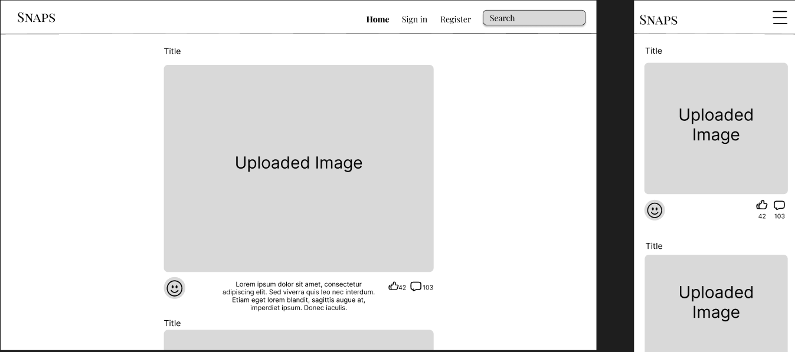

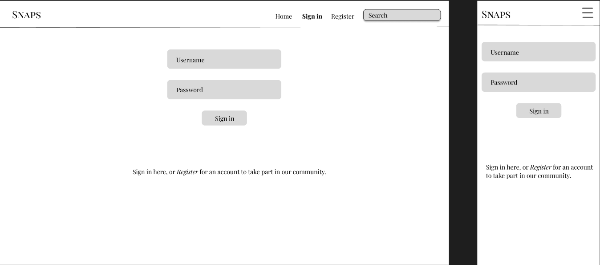

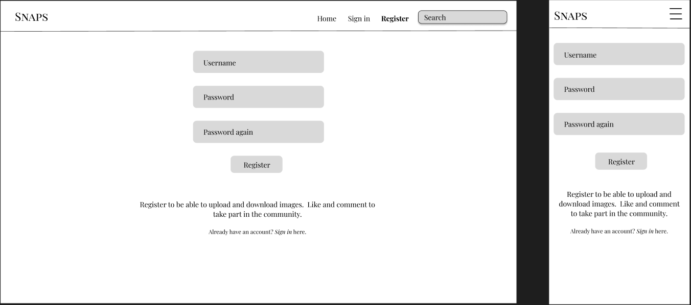

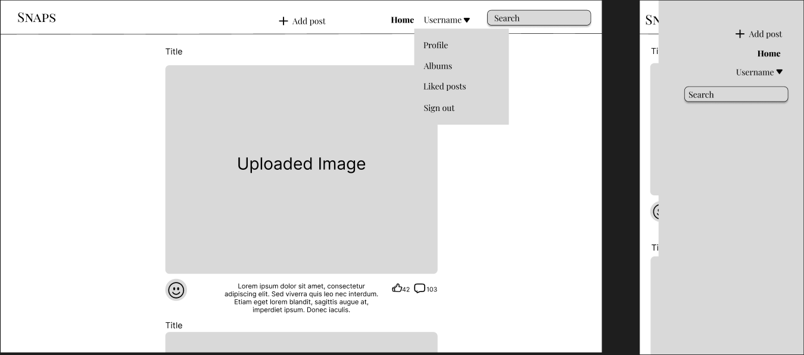

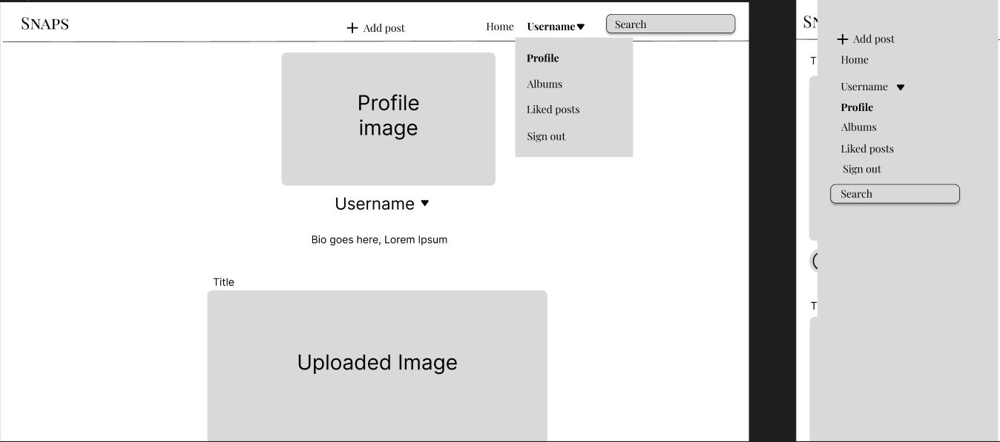

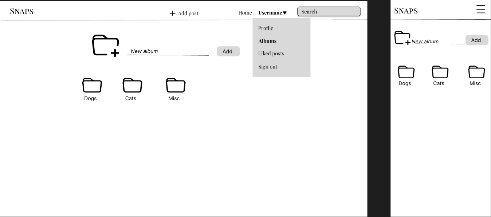

### Fonts

My main font used is "Playfair Display SC" which I used for its elegant style.

I paired it with "Gelasio" for input fields and areas with more text, for better readability.

I feel that these fonts in conjunction help create a sense of style and class.

### Colors

I mainly relied on a black and white interface, both for a clean look but also to let the colors

of the images on the website really stand out and take the main stage.

## Screenshots of Finished Website

This is the home page, with a user signed in.

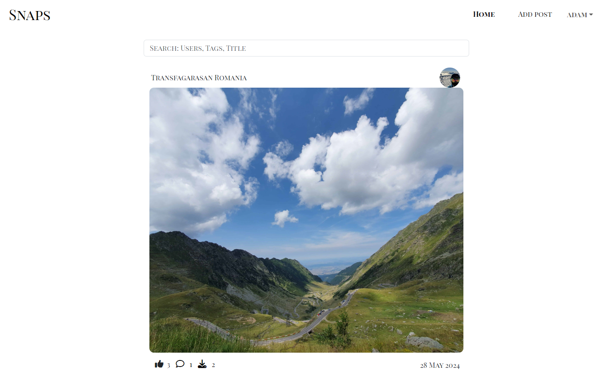

On the post detail page there are comments and ability to add post to an album.

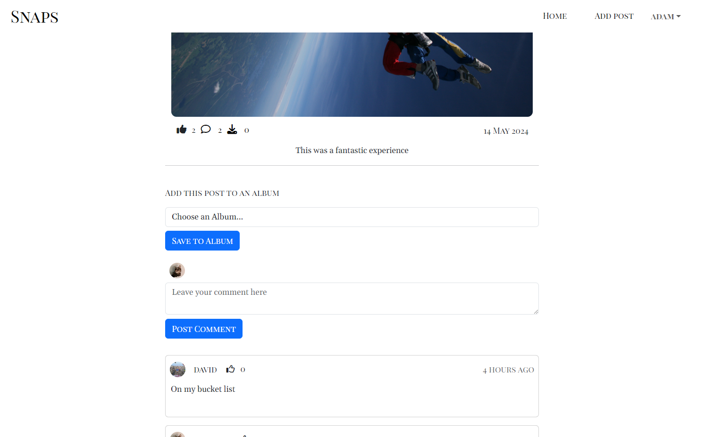

When you go to add a post, there is a nice preview of your selected photo.

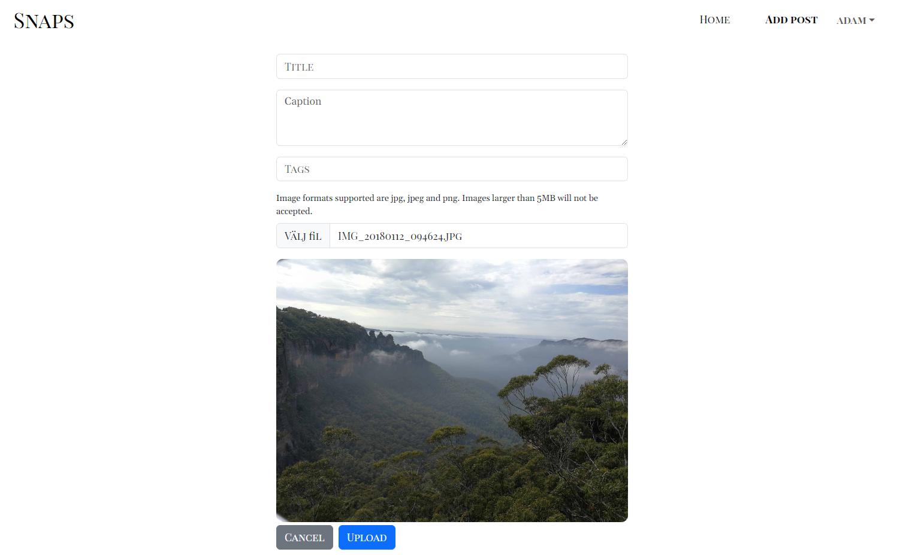

The dropdown for a signed in user applies both in the main navbar and the offcanvas on small devices.

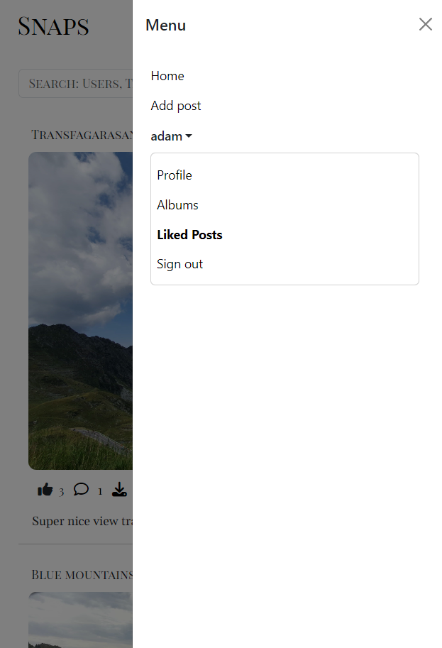

This is the albums page, where users can manage their albums.

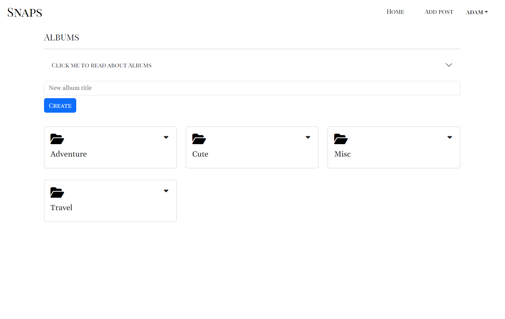

On the profile page, is the users photo of choice, their username and a bio, followed by all their posts.

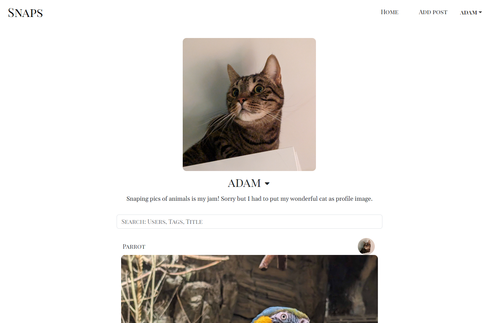

## Features

- Navbar is active, to display where you are on the website.

  This helps make navigation easier.

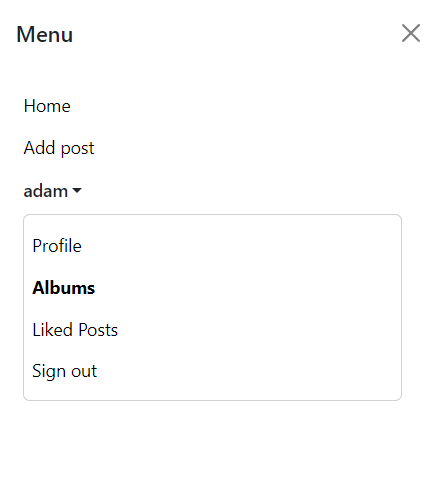

- Navbar is responsive, and will expand on large screens to reduce clicks, which helps navigate the site.

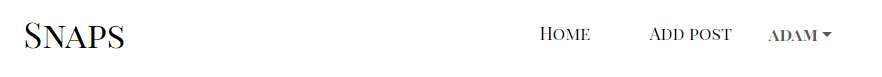

- When a user is signed in, the links specific to them are consolidated under their name,

  to reduce clutter, which looks nice but also make their things easy to find.

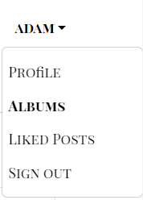

- The search field is helpful for users who want to find specific content.

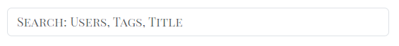

- The feeds with posts have an infinite scroll which loads new posts as the user reaches the bottom.

  Useful for the users to not have to click between pages.

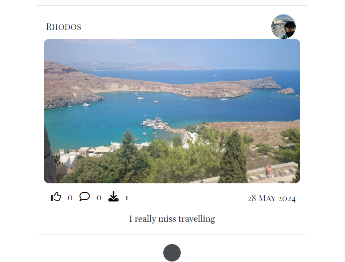

- A users avatar can be hovered to see their username right away.

  This helps users se more info with fewer clicks.

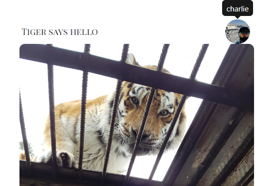

- Under a post additional information can be seen, such as likes, comments, downloads and image description.

  This helps users understand how their posts are performing.

  Moreover this is where users can click to like or download the image, or just read the description.

  It also shows when the post was updated last.

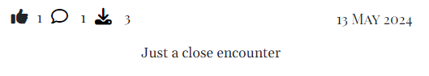

- Further down when viewing a single post, a user can add the post to one of their albums from a dropdown.

  This makes it easy for users so curate their content.

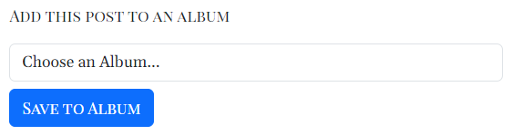

- Just below where a post can be added to an album, the comments start.

  This is where users go to add to the conversation about a post.

  Comments can be liked. The owner of a comment can edit or delete their comment.

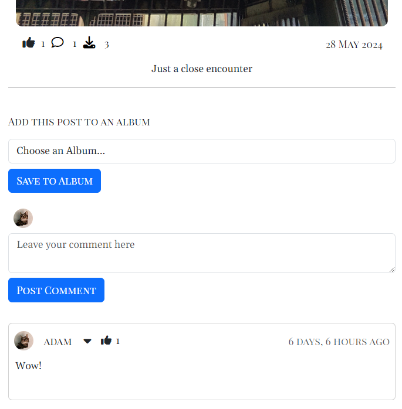

- This little dropdown arrow toggle is found throughout the website.

  It is a dropdown menu that allows users options to edit or delete their content.

  It only appears at content they are eligible to modify,

  such as posts, comments, albums and their profile.

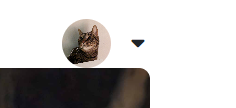

- In relevant places I have added success toast notifications.

  It helps reassure the user their actions were successful.

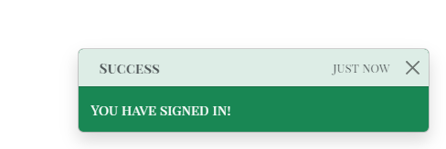

- In case of certain errors, a toast notification will let the user know

  that something went wrong. This will help in understanding why their action

  did not seem to do what they expected.

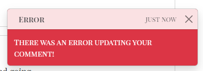

- If a user visits the Liked Posts page, they will find all the posts they have liked.

  This is a faster way of saving content for the user, but can't be organized as well as albums.

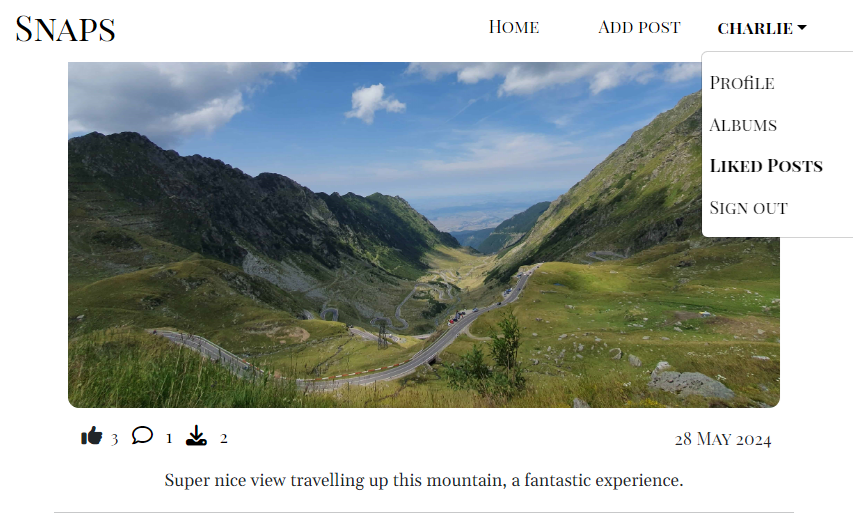

- If a user wants to save content in an organized manner, the albums page is the place to do so.

  They can create albums here, and then save content to them as they please.

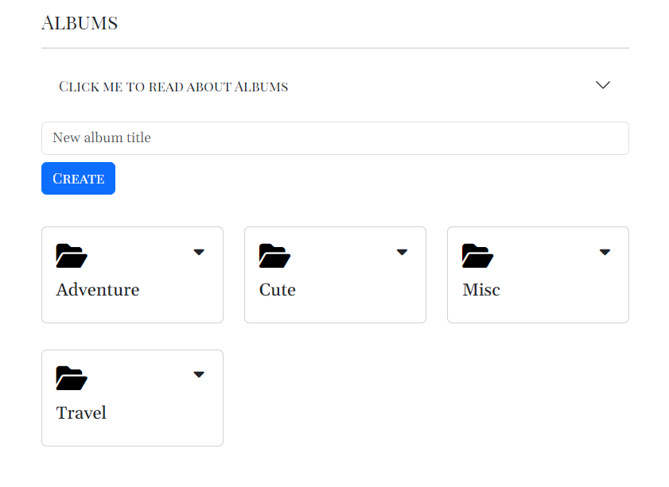

- In case a user does not understand what this page is for, there is a dropdown info panel

  that they can click to read more. This will be especially useful to new users.

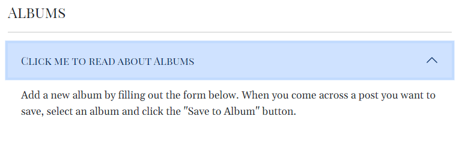

- Users profiles can be visited. This page holds their profile image, username and bio.

  All posts on this page belong to that profile owner.

  This is useful for many reasons, such as learning more about a user if they chose to add a bio,

  or just find more images from a creator you like.

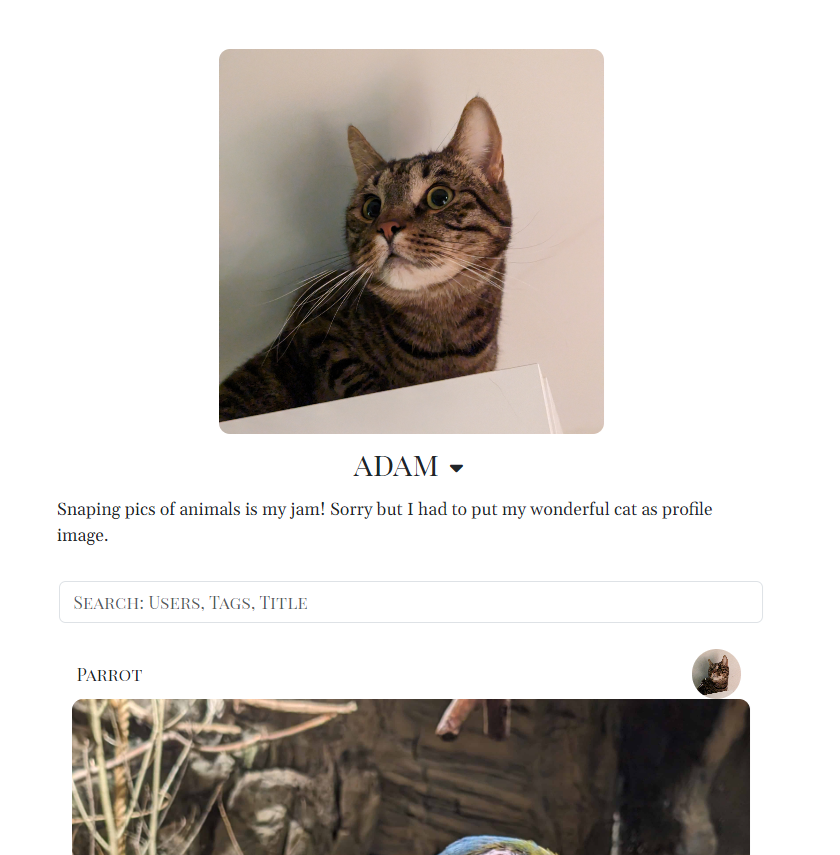

## Features to Add

This is a list of features I would have liked to add, but they did not make it into the

scope of this project. Also, this list is of course non exhaustive.

- **Keep page scroll**. When a user clicks a post and then returns to the feed,

  they should be returned to where they were in the feed.

- **Standard albums**. When a user creates an account, there could be one or more albums

  added automatically, such as "Favorites" for example.

- **Album naming**. I made a conscious choice to let users create albums without a title.

  The album will then default to "New Album", and they can rename it later.

  However it might be a good idea to not allow albums with the same name for a better user experience,

  so a feature that could be implemented it this:

  If an album receives a title already used by another one of their albums such as "Album",

  the new one could be automatically renamed "Album(1)" for example.

- **Editing posts in albums**. Currently there is no feature to move posts between albums,

  or delete a post from an album. The albums themselves can be renamed or deleted, and a post can

  be added to multiple albums, but simply moving a post to another album, or remove it, is not featured yet.

  This is definitely a feature that I would add in the future.

## React Components

### Reusable Components

- **DropdownInfo**: A component that expands when clicked to reveal a longer message.

  Useful for hiding longer texts that would clutter the UI.

- **SuccessToastNotification**: A notification used throughout the application to display

  successful user actions.

- **ErrorToastNotification**: A notification used to display certain errors to the user,

  signaling an action they took has failed.

- **Avatar**: A component used to display the users profile image in any place wanted.

- **ImageAsset**: Used to display post images, and the profile image in the users profile.

- **OwnerDropdown**: A dropdown menu used to give the owner of an item options for further actions.

- **NavBar**: Navigation bar used everywhere in the application.

### Contexts

- **CurrentUserContext**: Helps manage the current user state throughout the application.

### Hooks

- **useToggleNavBar**: A hook used to control the state of the navbar and offcanvas menu.

### API

- **axiosDefaults**: Default settings for easier use when calling out to my API using Axios.

  It configures a base URL and specifies the content type.

  It also enables sending cookies cross-site.

### Pages

#### Albums

The albums page was written into five different components.

- **AlbumCard**: Displays the album itself.

- **AlbumCreateForm**: The form input to create albums.

- **AlbumEditForm**: Displayed when user chooses to edit an album.

- **Albums**: The above components come together in Albums.

- **AlbumDetail**: When a specific album is clicked, the detail view shows the posts inside the album.

#### Auth

- **SignUpForm**: Handles the registration of new users.

- **SignInForm**: Handles the sign in process.

#### Comments

Comments were split up into three different components.

- **CommentCreateForm**: Concerned with adding comments.

- **Comment**: The actual content of a comment.

- **CommentEditForm**: Form for handling editing a comment.

#### Posts

Posts were split into 5 different components.

- **PostCreateForm**: Handles creation of posts.

- **Post**: The actual post itself.

- **PostEditForm**: Form for editing a post.

- **PostDetail**: Shows the post itself, form input for adding it to an album, and comments.

- **PostsFeed**: Used anywhere a feed of posts is needed, for example Home and Liked Posts.

#### Profiles

Profiles was split into three components.

- **Profile**: Holds the profile information such as image, bio, and owner edit option.

- **ProfilePage**: Displays the profile information along with a feed of the profile owners posts.

- **ProfileEditForm**: A form for editing profile information.

## Framework and Languages

This project was built using React 18.3.1

JavaScript and JSX was used to write the code.

The README was written using Markdown.

## Libraries

- **Axios**: Used for making requests to my API.

- **React-bootstrap**: Used for its good set of components, styles and ease of use.

- **React-router-dom**: Used for routing features, and additional features such as using

  searchParams, useLocation and useNavigate. This was especially helpful in setting up toast notifications.

  and routing the user between pages.

- **React-infinite-scroll-component**: Since my API sends paginated data, this was helpful in

  setting up a continuous feed for the user.

## Deployment

This part describes the steps I took to deploy this React project.

1. In package.json I added `"heroku-prebuild": "npm install -g serve",` in the scripts section.

   Needed to serve this single page application on Heroku.

2. Add a Procfile in the root-directory and add `web: serve -s build` inside.

   Tells Heroku that this is a web process and to serve a our single page application.

3. Go to [Heroku](https://www.heroku.com/) and sign in/register.

4. Create a new app, choose a new name and select your region and click "create app".

5. Go to the "Deploy" tab and connect to GitHub.

6. Search for the repository to deploy, and click connect.

7. Click "Deploy branch".

### Cloning and Forking

If you want to clone or fork this project, you can do it from my [GitHub repository](https://github.com/hogbergmarkus/snaps).

Keep in mind that this is only the front-end and you will need a back-end to run this application.

Take a look at the [Back-end repository](https://github.com/hogbergmarkus/snaps-backend), for more
information on how to set that up.

You should start by setting up a virtual environment, to avoid conflicts and other potential issues.

**Cloning** the project means you are creating a local copy of the project on your own machine.

This enables you to make changes without affecting the original repository.

**Forking** it means you are creating a copy of the project on your own GitHub account,

which gives you the ability to propose changes to the original project,

or just develop your own modified version of it.

- Since this project uses npm, it is good practice you do the same.

- Make sure you are in the root directory, then run `npm install`

- In the src directory, open axiosDefaults.js and change `axios.defaults.baseURL` to your own API url.

## Testing

### Validation

I ran all my pages through the [W3C markup validation service](https://validator.w3.org/#validate_by_uri) with no errors.

My custom CSS was checked using [jigsaw](https://jigsaw.w3.org/css-validator/#validate_by_input) with no errors.

The console and terminal are showing no errors from my JSX and JavaScript.

### Lighthouse Reports

Below are lighthouse reports from my pages:

- Home:

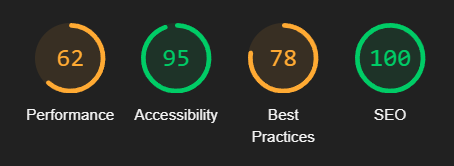

- Post detail:

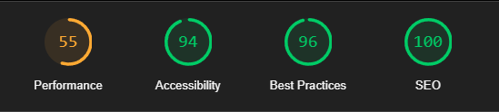

- Post edit:

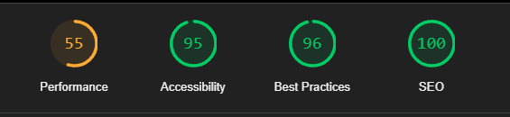

- Liked posts:

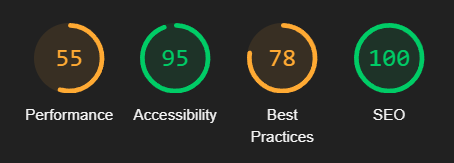

- Albums:

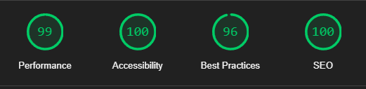

- Album detail:

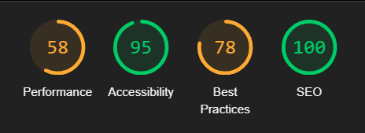

- Profiles:

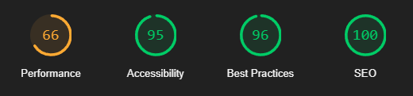

- Profile edit:

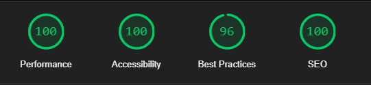

- Register:

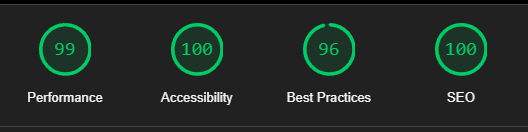

- Sign in:

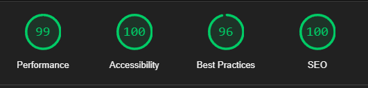

### Responsiveness

The website was tested throughout development, to function well on any screen size.

The main devices used for testing during development were:

- Desktop

- Iphone 12 pro

- Google pixel 7

- Ipad

After deploying to Heroku, I have tested further on my own:

- Google pixel 8 pro

- My own desktop computer.

Browsers tested:

- Google Chrome

- Microsoft Edge

- Brave

### Manual Testing

Each title under "Works" was tested manually and marked with an X for yes if it works, and no if it does not.

The Final tests marked here was conducted on the deployed version on Heroku.

#### Navbar

| Works                                                              | YES | NO  |
| ------------------------------------------------------------------ | :-: | --- |
| "Snaps" lead to Home page when clicked                             |  X  |     |
| Current page is active                                             |  X  |     |
| Current page is marked in bold text                                |  X  |     |
| Navbar collapses to hamburger on smaller screen                    |  X  |     |
| Hamburger icon expands when clicked                                |  X  |     |
| Links still work when navbar is collapsed                          |  X  |     |
| Conditional statement hides user specific links when not signed in |  X  |     |

#### Search Bar

| Works                                       | YES | NO  |
| ------------------------------------------- | :-: | --- |
| Search bar is displayed on Home page        |  X  |     |
| Search bar is displayed on Liked posts page |  X  |     |
| I can search for image tags                 |  X  |     |
| I can search for image title                |  X  |     |
| I can search for image owner                |  X  |     |

#### Home Page

| Works                                                                           | YES | NO  |
| ------------------------------------------------------------------------------- | :-: | --- |
| Page loads                                                                      |  X  |     |
| When I scroll to the bottom, new posts load automatically                       |  X  |     |
| When I click a post, it takes me to the post detail view                        |  X  |     |
| I can like a post straight from the post feed                                   |  X  |     |
| When I like a post, the like count is incremented                               |  X  |     |
| I can un-like a post straight from the post feed                                |  X  |     |
| When I un-like a post, the like count is decremented                            |  X  |     |
| If I click the comments icon, it takes me to the post detail view               |  X  |     |
| If I click the download icon, it opens a new tab where I can download the image |  X  |     |
| If I click the download icon, the download count is incremented                 |  X  |     |
| If I click the owners avatar, I am taken to their profile                       |  X  |     |

#### Post Detail

| Works                                                                                            | YES | NO  |
| ------------------------------------------------------------------------------------------------ | :-: | --- |
| Page loads                                                                                       |  X  |     |
| If I own the post, a dropdown is displayed next to my avatar                                     |  X  |     |
| The owner dropdown display choices for edit and delete                                           |  X  |     |
| I can like the post                                                                              |  X  |     |
| When I like the post, the like count is incremented                                              |  X  |     |
| I can un-like the post                                                                           |  X  |     |
| When I un-like the post, the like count is decremented                                           |  X  |     |
| If I click the comments icon, nothing happens                                                    |  X  |     |
| If I click the download icon, it opens a new tab where I can download the image                  |  X  |     |
| If I click the download icon, the download count is incremented                                  |  X  |     |
| If I click the owners avatar, I am taken to their profile                                        |  X  |     |
| I can add the post to an album                                                                   |  X  |     |
| If I have no albums, the "save to album" button is disabled                                      |  X  |     |
| If I have no albums, the dropdown explains I have no albums yet                                  |  X  |     |
| If I try adding the post to an album without selecting one, there is an error toast notification |  X  |     |
| I can leave a comment                                                                            |  X  |     |
| I can edit my own comment                                                                        |  X  |     |
| I can delete my own comment                                                                      |  X  |     |
| I can like a comment                                                                             |  X  |     |
| When I like a comment, the like count increments                                                 |  X  |     |
| I can un-like a comment                                                                          |  X  |     |
| When I un-like a comment, the like count decrements                                              |  X  |     |

#### Edit Post

| Works                                                                    | YES | NO  |
| ------------------------------------------------------------------------ | :-: | --- |
| Page loads                                                               |  X  |     |
| A preview of my post image is displayed                                  |  X  |     |
| My old title is prefilled                                                |  X  |     |
| My old caption is prefilled                                              |  X  |     |
| My old tags are prefilled                                                |  X  |     |
| Cancel button takes me back to the post detail view                      |  X  |     |
| The form displays error messages if I do something wrong                 |  X  |     |
| When submitted my changes are saved                                      |  X  |     |
| When submitted I am taken back to the post detail view to see my changes |  X  |     |

#### Delete Post

| Works                                                           | YES | NO  |
| --------------------------------------------------------------- | :-: | --- |
| When selecting to delete my post, there is a confirmation modal |  X  |     |
| If i click cancel in the modal, it closes and nothing happens   |  X  |     |
| If I confirm the deletion, the post is deleted                  |  X  |     |
| After the post is deleted I am redirected to my profile         |  X  |     |
| After the deletion, a toast notification confirms the deletion  |  X  |     |

#### Add Post

| Works                                                                | YES | NO  |
| -------------------------------------------------------------------- | :-: | --- |
| Page loads                                                           |  X  |     |
| If a non logged in user tries to access the page they are redirected |  X  |     |
| Form displays messages to alert users of mistakes                    |  X  |     |
| Cancel button takes me back to the previous page I was on            |  X  |     |
| Uploaded image has a preview                                         |  X  |     |
| When the form is submitted I am redirected to the post detail view   |  X  |     |
| When the form is submitted there is a success toast notification     |  X  |     |

#### Liked Posts

| Works                                               | YES | NO  |
| --------------------------------------------------- | :-: | --- |
| Page loads                                          |  X  |     |
| The page filters to display only posts I have liked |  X  |     |

#### Albums

| Works                                                                | YES | NO  |
| -------------------------------------------------------------------- | :-: | --- |
| Page loads                                                           |  X  |     |
| Page displays a dropdown with an explanation of how to use albums    |  X  |     |
| When the explanation dropdown is clicked it expands to show the text |  X  |     |
| If the dropdown is expanded and clicked, it collapses                |  X  |     |
| New albums can be created                                            |  X  |     |
| When an album is created I am redirected to the album detail view    |  X  |     |
| When an album is created there is a success toast notification       |  X  |     |
| Albums have a dropdown menu with edit and delete options             |  X  |     |
| Clicking an album takes me to the album detail view                  |  X  |     |

#### Edit Album

| Works                                                 | YES | NO  |
| ----------------------------------------------------- | :-: | --- |
| When choosing to edit an album, an edit form displays |  X  |     |
| The edit form has the old title prefilled             |  X  |     |
| Clicking cancel closes the form without changes       |  X  |     |
| Clicking save updates the album title                 |  X  |     |
| Clicking save closes the edit form                    |  X  |     |

#### Delete Album

| Works                                                           | YES | NO  |
| --------------------------------------------------------------- | :-: | --- |
| When choosing to delete an album, there is a confirmation modal |  X  |     |
| Clicking cancel in the modal, closes the modal                  |  X  |     |
| Clicking delete in the modal deletes the album                  |  X  |     |
| Clicking delete in the modal closes the modal                   |  X  |     |
| At deleting the album a success toast notification shows up     |  X  |     |

#### Album Detail

| Works                                               | YES | NO  |
| --------------------------------------------------- | :-: | --- |
| Page loads                                          |  X  |     |
| The album detail displays posts added to that album |  X  |     |

#### Profile

| Works                                                          | YES | NO  |
| -------------------------------------------------------------- | :-: | --- |
| Page loads                                                     |  X  |     |
| Profile image is displayed                                     |  X  |     |
| Username is displayed                                          |  X  |     |
| If I own the profile, a dropdown with edit option is displayed |  X  |     |
| If user has added a bio it is displayed                        |  X  |     |
| Profile owner posts can be searched                            |  X  |     |
| Profile owners posts are shown in a feed                       |  X  |     |

#### Edit Profile

| Works                                           | YES | NO  |
| ----------------------------------------------- | :-: | --- |
| Page loads                                      |  X  |     |
| Username is prefilled                           |  X  |     |
| Old profile image is displayed                  |  X  |     |
| Cancel button takes me back to my profile       |  X  |     |
| Username can not be empty                       |  X  |     |
| Image upload shows new image in preview         |  X  |     |
| When I press save my new information is saved   |  X  |     |
| When I press save I am taken back to my profile |  X  |     |

#### Register

| Works                                                     | YES | NO  |
| --------------------------------------------------------- | :-: | --- |
| Page loads                                                |  X  |     |
| The link to the sign in page takes me to the sign in page |  X  |     |
| The form will not allow any blank fields                  |  X  |     |
| The passwords must match                                  |  X  |     |
| On successful sign up I am taken to the sign in page      |  X  |     |

#### Sign In

| Works                                                       | YES | NO  |
| ----------------------------------------------------------- | :-: | --- |
| Page loads                                                  |  X  |     |
| The link to the register page takes me to the sign register |  X  |     |
| The form will not allow any blank fields                    |  X  |     |
| On successful sign in I am taken to the home page           |  X  |     |
| On successful sign in I can see my username in the navbar   |  X  |     |

### User Stories Testing

Here I have viewed the user stories in my GitHub project, and carefully gone through my acceptance criteria for each user story.

If the criteria is met, it is marked in these tables below.

Finally the issue for each user story in my project has been closed if the acceptance criteria was met.

#### Navigation

- As a Site User I can access a navbar from every page so that I can navigate the site easily.

| Acceptance criteria met           | YES | NO  |
| --------------------------------- | :-: | --- |
| Nav bar is present on all pages   |  X  |     |
| Navbar can be used for navigation |  X  |     |

#### Authentication

- As a Site User I can register an account so that I can access more features.

| Acceptance criteria met                       | YES | NO  |
| --------------------------------------------- | :-: | --- |
| I can access the page to register an account. |  X  |     |
| There is a form that I can use to sign up.    |  X  |     |
| The form creates an account when submitted.   |  X  |     |

- As a Site User I can sign in so that I get access to additional features.

| Acceptance criteria met            | YES | NO  |
| ---------------------------------- | :-: | --- |
| Sign in page is accessible         |  X  |     |
| Sign in page has a form to sign in |  X  |     |
| A registered user can sign in      |  X  |     |

- As a Site User I can see my logged in status so that I can log out if I need to.

| Acceptance criteria met                                        | YES | NO  |
| -------------------------------------------------------------- | :-: | --- |
| When I am logged in it is reflected with my name in the navbar |  X  |     |
| I get access to additional links                               |  X  |     |

- As a Site User I can remain logged in for some time, or until I log out so that I have a good experience.

| Acceptance criteria met                             | YES | NO  |
| --------------------------------------------------- | :-: | --- |
| After signing in, I stay signed in until I sign out |  X  |     |

#### Posts

- As a Site User I can add posts so that I can share my content.

| Acceptance criteria met                       | YES | NO  |
| --------------------------------------------- | :-: | --- |
| I can access Add Post when logged in          |  X  |     |
| Add Post has a form to create a post          |  X  |     |
| When the form is submitted my post is created |  X  |     |

- As a Site User I can view a single post so that I can interact with it.

| Acceptance criteria met                       | YES | NO  |
| --------------------------------------------- | :-: | --- |
| When visiting the URL of a post I can view it |  X  |     |

- As a Site User I can like a post so that I can show appreciation.

| Acceptance criteria met                                          | YES | NO  |
| ---------------------------------------------------------------- | :-: | --- |
| When viewing a post I can like it                                |  X  |     |
| If I change my mind and click it again the post will be un-liked |  X  |     |

- As a Site User I can download a post image so that I can keep it for later.

| Acceptance criteria met                                      | YES | NO  |
| ------------------------------------------------------------ | :-: | --- |
| When viewing a post there is a download button               |  X  |     |
| The button takes me to a page where I can download the image |  X  |     |
| Download count is incremented                                |  X  |     |

- As a Site User I can view a feed of posts so that I can get the latest content.

| Acceptance criteria met                         | YES | NO  |
| ----------------------------------------------- | :-: | --- |
| When on the homepage a feed of posts are loaded |  X  |     |

- As a Site User I can view posts I have liked so that I can find my way back to them easily.

| Acceptance criteria met                              | YES | NO  |
| ---------------------------------------------------- | :-: | --- |
| On the liked posts page I can see posts I have liked |  X  |     |

- As a Site User I can delete my post so that I can remove it if I want to.

| Acceptance criteria met                                   | YES | NO  |
| --------------------------------------------------------- | :-: | --- |
| A signed in user can delete their own posts               |  X  |     |
| There should be a confirmation before the post is deleted |  X  |     |

- As a Site User I can edit my post so that I can change it if I want to.

| Acceptance criteria met                                                              | YES | NO  |
| ------------------------------------------------------------------------------------ | :-: | --- |
| When viewing a post as the owner, I can choose to edit the post                      |  X  |     |
| When clicking edit post, I get taken to a form that is pre-filled with the post data |  X  |     |
| When submitting the updated data, my post is updated                                 |  X  |     |

#### Search

- As a Site User I can search for posts so that I can find content I'm looking for.

| Acceptance criteria met                                                   | YES | NO  |
| ------------------------------------------------------------------------- | :-: | --- |
| A search bar exists                                                       |  X  |     |
| Typing in the search bar will return results based on User, tags or title |  X  |     |

#### Infinite Scroll

- As a Site User I can scroll infinitely so that I never have to click next page to see more posts.

| Acceptance criteria met                                           | YES | NO  |
| ----------------------------------------------------------------- | :-: | --- |
| When I reach the bottom of the page more posts load automatically |  X  |     |

#### Comments

- As a Site User I can add comments to a post so that I can engage with the community.

| Acceptance criteria met                     | YES | NO  |
| ------------------------------------------- | :-: | --- |
| A signed in user can add comments to a post |  X  |     |
| A signed out user can not add comments      |  X  |     |

- As a Site User I can view comments so that I can read what other users think of the post.

| Acceptance criteria met                                   | YES | NO  |
| --------------------------------------------------------- | :-: | --- |
| When a user is viewing a post, they can also see comments |  X  |     |

- As a Site User I can delete my comments so that I can remove them if I want to.

| Acceptance criteria met                                            | YES | NO  |
| ------------------------------------------------------------------ | :-: | --- |
| When a user views their comment, they have the option to delete it |  X  |     |
| Deleting a comment decrements the comments count by 1              |  X  |     |
| Deleting a comment removes the comment                             |  X  |     |

- As a Site User I can edit my comments so that I can change them if I want to.

| Acceptance criteria met                                                             | YES | NO  |
| ----------------------------------------------------------------------------------- | :-: | --- |
| A user can choose to edit their comments                                            |  X  |     |
| When they choose to do so, they are presented with their comment content pre-filled |  X  |     |
| When submitted, the comment is updated                                              |  X  |     |

- As a Site User I can like comments so that I can show people I liked what they said.

| Acceptance criteria met                       | YES | NO  |
| --------------------------------------------- | :-: | --- |
| A signed in user can like a comment           |  X  |     |
| A signed out user cannot like a comment       |  X  |     |
| When a user creates a like, likes count go up |  X  |     |

- As a Site User I can unlike a comment so that I can change my mind.

| Acceptance criteria met                                            | YES | NO  |
| ------------------------------------------------------------------ | :-: | --- |
| When a user has liked a comment, they can click it again to unlike |  X  |     |

#### Albums

- As a Site User I can create albums so that I can get organized.

| Acceptance criteria met                                               | YES | NO  |
| --------------------------------------------------------------------- | :-: | --- |
| User can fill out a form to create albums                             |  X  |     |
| The creation form should be on the same page as the albums are listed |  X  |     |

- As a Site User I can view my albums so that I can interact with them

| Acceptance criteria met                                 | YES | NO  |
| ------------------------------------------------------- | :-: | --- |
| When navigating to Albums the user can see their albums |  X  |     |

- As a Site User I can delete my albums so that I can remove them if I want to.

| Acceptance criteria met                           | YES | NO  |
| ------------------------------------------------- | :-: | --- |
| A user is able to delete albums they have created |  X  |     |

- As a Site User I can edit my albums so that I can change their names if I want to.

| Acceptance criteria met                          | YES | NO  |
| ------------------------------------------------ | :-: | --- |
| Users are able to edit the title of their albums |  X  |     |

- As a Site User I can add posts to albums so that I can sort content as I want to.

| Acceptance criteria met                                              | YES | NO  |
| -------------------------------------------------------------------- | :-: | --- |
| When a user is viewing a post, they can choose to add it to an album |  X  |     |
| The user must first have created the album                           |  X  |     |

- As a Site User I can view posts I have added to my albums so that I can find the posts I want.

| Acceptance criteria met                                                              | YES | NO  |
| ------------------------------------------------------------------------------------ | :-: | --- |
| If a user has albums with posts added, they can click their albums to view the posts |  X  |     |

#### Profiles

- As a Site User I can visit other users profiles so that I can learn more about them.

| Acceptance criteria met                                                                                             | YES | NO  |
| ------------------------------------------------------------------------------------------------------------------- | :-: | --- |
| When visiting a users profile their profile image is visible                                                        |  X  |     |
| When visiting a users profile there is a field where I can read about the profile owner if they have added anything |  X  |     |
| Their username is displayed                                                                                         |  X  |     |

- As a Site User I can edit my profile so that I can change what users see about me.

| Acceptance criteria met                                                | YES | NO  |
| ---------------------------------------------------------------------- | :-: | --- |
| Owner of the profile has a dropdown menu where they can choose to edit |  X  |     |
| When clicked, they get a form where information can be edited          |  X  |     |
| When form is submitted, their profile is updated                       |  X  |     |

## Bugs

### Bug 1

I had bug that cut off the dropdown menu in my navbar. It caused some overflow issues

since it fell outside the other content.

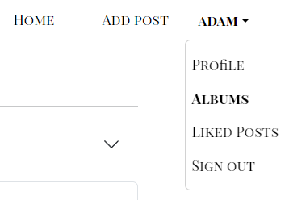

## Bug Fixes

### Bug Fix 1

This caused me quite some frustration, since I did not manage to fix it for some time.

Eventually I found the solution in react-bootstraps library, I had simply missed the `align` prop for dropdowns.

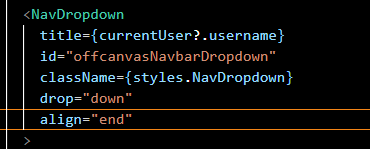

